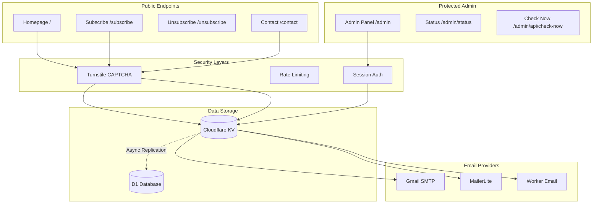
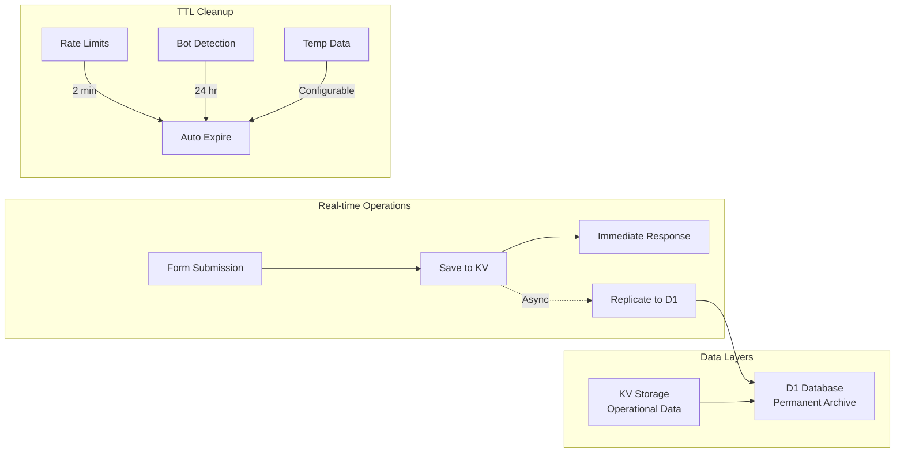
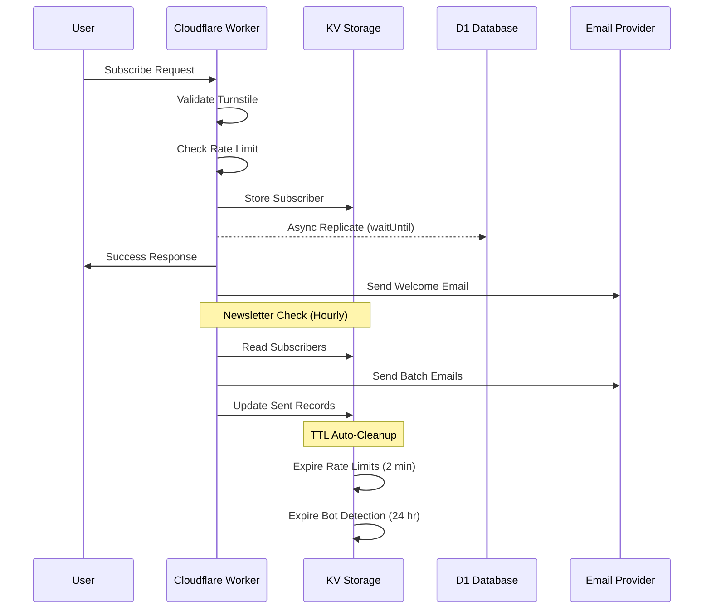

# Serverless Newsletter & Contact Management System using Cloudflare Workers

A production-ready, serverless newsletter and contact form management system built on Cloudflare Workers with enterprise-grade security, dual-layer data persistence, and multiple email provider support.

## 🚀 Features

### Core Functionality
- **Newsletter Management**: Automated RSS feed monitoring and batch email delivery
- **Contact Forms**: Integrated contact system with auto-subscribe option
- **Subscriber Management**: Double opt-in support with secure unsubscribe links
- **Multiple Email Providers**: Gmail SMTP, MailerLite API, and Cloudflare Email Routing

### Security & Protection
- **Admin Panel Security**: Session-only authentication, no external API access
- **Bot Protection**: Cloudflare Turnstile CAPTCHA integration
- **Two-Layer Rate Limiting**:
  - Native Cloudflare Rate Limiting (cached, no KV costs)
  - KV-based fallback for granular control
- **XSS Protection**: Comprehensive input sanitization
- **No PII Exposure**: Customer data never exposed through APIs

### Data Management
- **Dual Storage System**:
  - KV for operational data (fast access, subscriber management)
  - D1 database for archival (SQL-based, permanent append-only storage)
- **Real-time D1 Replication**: Automatic async replication from KV to D1
- **Auto-Cleanup**: TTL-based expiration for temporary data
- **Append-Only Archive**: D1 maintains permanent audit trail

### Performance Optimizations
- **Async Processing**: Non-blocking D1 replication using ctx.waitUntil()
- **Prefix-Based Queries**: Efficient KV operations using prefix filtering
- **Batch Processing**: Configurable batch sizes for email delivery
- **Retry Logic**: Exponential backoff with dead letter queue

## 📊 System Architecture



## 🔄 Data Persistence Strategy



## 📁 Project Structure

```
src/
├── index.js                    # Main entry point & route handler
├── config/
│   └── config.js              # Centralized configuration
├── newsletter/
│   ├── frontend/
│   │   ├── subscribe.js       # Subscribe form & handler
│   │   └── unsubscribe.js     # Unsubscribe form & handler
│   └── backend/
│       └── processor.js       # RSS feed processing & email queue
├── contact/
│   └── frontend.js            # Contact form with retry logic
├── email/
│   ├── gmailProvider.js       # Gmail SMTP via worker-mailer
│   ├── mailerLiteProvider.js  # MailerLite API integration
│   ├── workerEmailProvider.js # Cloudflare Email routing
│   └── emailFactory.js        # Provider factory pattern
├── middleware/
│   └── protection.js          # Rate limiting & bot protection
├── pages/
│   ├── status.js              # System status page
│   └── admin.js               # Admin panel interface
└── utils/
    ├── adminRateLimit.js      # Admin-specific rate limiting
    ├── kv.js                  # KV storage utilities
    ├── d1Replication.js       # D1 database replication (async)
    ├── validation.js          # Input validation & sanitization
    ├── retry.js               # Retry logic implementation
    ├── nativeRateLimit.js     # Native Cloudflare rate limiting
    └── feedParser.js          # Universal feed parser
```

## 🔐 Security Features

### Authentication & Authorization
- **Admin Panel**: Session-based authentication only
- **API Access**: Completely disabled for maximum security
- **Turnstile Protection**: All forms require CAPTCHA validation
- **Two-Layer Rate Limiting**:
  - **Native Rate Limiting** (First Layer - No KV costs):
    - Global: 25 requests per minute per IP
    - Forms: 3 requests per minute per IP
    - Admin: 5 requests per minute per IP
    - Newsletter Check: 10 requests per minute per IP
    - Bot Detection: 1 request per minute for suspicious IPs
  - **KV-Based Rate Limiting** (Second Layer - More restrictive):
    - Forms: 5 submissions per 24 hours per IP
    - Admin API: 5 requests per 24 hours per IP
    - Global: 30 requests per minute per IP

### Data Protection
- **No PII Exposure**: Customer emails/IPs never returned in API responses
- **Sanitized Responses**: Only counts and success indicators returned
- **XSS Prevention**: All inputs sanitized with proper escaping
- **Append-Only D1**: No deletes, maintaining complete audit trail

## 📊 Data Flow Diagram



## ⚙️ Configuration

### Environment Variables (wrangler.toml)

```toml
# Email Provider Configuration
EMAIL_PROVIDER = "gmail"  # Options: gmail, mailerlite, worker-email

# Batch Processing
BATCH_SIZE = 100
BATCH_WAIT_MINUTES = 5

# TTL Configuration (seconds)
TTL_RATE_LIMIT = 120      # 2 minutes
TTL_BOT_DETECT = 86400    # 24 hours

# KV-Based Rate Limiting (Second Layer)
RATE_LIMIT_MAX = 5
RATE_LIMIT_WINDOW_HOURS = 24
ADMIN_API_RATE_LIMIT_MAX = 5

# Native Rate Limiting Configuration (First Layer)
# Add these to your wrangler.toml file:
# [[ratelimits]]
# name = "GLOBAL_RATE_LIMITER"
# namespace_id = "1001"
# simple = { limit = 25, period = 60 }
#
# [[ratelimits]]
# name = "FORM_RATE_LIMITER"
# namespace_id = "1002"
# simple = { limit = 3, period = 60 }
#
# [[ratelimits]]
# name = "ADMIN_RATE_LIMITER"
# namespace_id = "1003"
# simple = { limit = 5, period = 60 }
```

### Required Secrets

```bash
# Core Requirements
wrangler secret put EMAIL_FROM_ADDRESS
wrangler secret put TURNSTILE_SITE_KEY
wrangler secret put TURNSTILE_SECRET_KEY

# For Gmail Provider
wrangler secret put GMAIL_USER
wrangler secret put GMAIL_PASSWORD  # App Password

# For MailerLite Provider
wrangler secret put MAILERLITE_API_TOKEN
```

## 🚀 Deployment

### Prerequisites
1. Cloudflare account with Workers enabled
2. KV namespace created
3. D1 database created with tables
4. Email provider credentials
5. Turnstile site configured

### Installation

```bash
# Clone the repository
git clone <your-repo-url>
cd newsletter-and-contact-system

# Install dependencies
npm install

# Configure secrets
wrangler secret put EMAIL_FROM_ADDRESS
# ... (add other secrets)

# Deploy
npx wrangler deploy
```

### Post-Deployment
1. Configure Cloudflare Zero Trust for `/admin/*` paths (optional)
2. Set up custom domain (optional)
3. Test all endpoints
4. Monitor logs in Cloudflare dashboard

## 📈 Performance Characteristics

### KV Operations
- **Prefix Filtering**: All operations use efficient prefix queries
- **Batch Processing**: Configurable batch sizes for email delivery
- **CPU Safety**: Optimized for Cloudflare Workers execution limits

### D1 Replication
- **Async Processing**: Uses ctx.waitUntil() for non-blocking writes
- **Error Resilient**: Failures don't affect user experience
- **Append-Only**: No deletes or complex queries

### Email Delivery
- **Batch Size**: 100 emails per batch
- **Retry Logic**: 3 attempts with exponential backoff
- **Dead Letter Queue**: Failed emails stored for manual review

## 🔍 Monitoring & Maintenance

### Admin Panel
```
https://your-worker.workers.dev/admin
```

### Status Endpoint
```
https://your-worker.workers.dev/admin/status
```

### Automatic Maintenance
- **Hourly**: Newsletter feed checking
- **Continuous**: TTL-based expiration for temporary data
- **Real-time**: Async D1 replication on form submissions

## 📝 API Endpoints

### Public Endpoints
| Endpoint | Method | Description |
|----------|--------|-------------|
| `/` | GET | Homepage |
| `/subscribe` | GET/POST | Newsletter subscription |
| `/unsubscribe` | GET/POST | Newsletter unsubscription |
| `/contact` | GET/POST | Contact form |
| `/robots.txt` | GET | Robots.txt file |

### Protected Admin Endpoints
| Endpoint | Method | Description |
|----------|--------|-------------|
| `/admin` | GET | Admin panel (Turnstile) |
| `/admin/status` | GET | System status |
| `/admin/api/check-now` | POST | Trigger newsletter check |

## 🤝 Contributing

1. Fork the repository
2. Create your feature branch
3. Commit your changes
4. Push to the branch
5. Create a Pull Request

## 📄 License

This project is licensed under the MIT License.

## 🙏 Acknowledgments

- Cloudflare Workers platform
- worker-mailer library for SMTP support
- MailerLite API
- Cloudflare D1 Database

## 📞 Support

For issues and questions, please create an issue in the GitHub repository.

---

**Version**: 2.0.0
**Status**: Production Ready
**Last Updated**: 11 November 2025